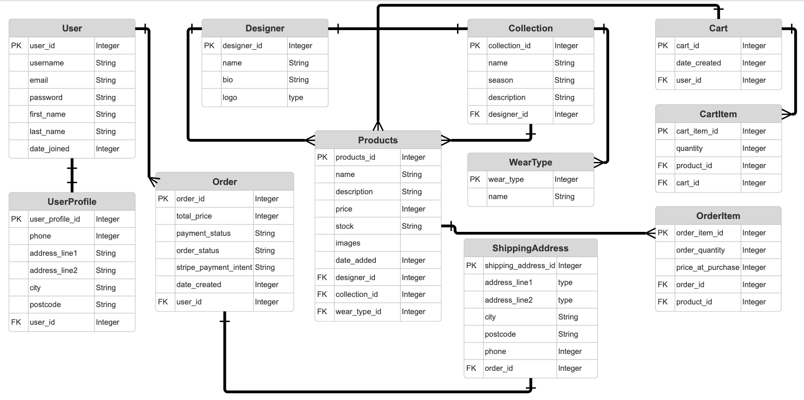

# Saira Studio

## Project overview / About Saira Studio

Saira Studio is a modern South Asian fashion e-commerce platform designed to bring elegant, high quality formal and casual wear to customers with a seamless online shopping experience. The platform aims to deliver a polished, enjoyable, and visually engaging experience from homepage to checkout. The site presents a curated style from Saira to put forward to her audience of women who are interested in south east asian wear whether it's for an occassion or for casual wear. The site helps connect customers to designer outfits that they otherwise would struggle to get due to the logistical issue many of those designers in south east asia have. The business aim is to build a scalable online boutique

## Features

### Implemented features  
- **Responsive design:** To allow for good useability through phone, tablet and desktop.
- **Product Management:** Create, Read, Update and Delete products fromm the online store (CRUD).
- **Authentication:** Customer and site owner (through superuser) login/logout. 
- **Payment system:** Introduce Stripe payments system for customers to place orders.

### Future features
- **Stock management:** Allow site owner to see and understand their stock levels. Auto updaate stock after orders and email site owner low stock alerts.
- **Wishlist / favourite system:** Logged in users can 'heart' products. Use information for analytics on popular products.
**Customer profile dashboard:** Store important details, saved addresses, measurements for custom tailoring.

---

## UX design

### User Stories
As a customer, I want to browse products by designer so I can shop for my preferred brands.  
As a customer, I want to browse collections (e.g., “Eid 2024”, “Wedding Edit”) so I can explore themed outfits.  
As a customer, I want to log in and log out so I can secure access to my account.  
As a customer, I want to add items to my cart so I can purchase multiple products.

As the site owner, I want to add new products so that I can update the catalogue.  
As the store owner, I want to delete products so I can remove items that are no longer available.  
As the store owner, I want to add collections (Eid, Bridal, Winter) so the website reflects seasonal releases.  
As the store owner, I want to track stock levels so I know when to restock items.  

As a user, I want to browse products without logging in so I can explore the shop freely.  
As a user, I want the website to be responsive so I can use it on mobile, tablet, or desktop.  

### Database Schema
Entity Relationship Diagram (ERD)

### Stratergy

#### 1. Project Purpose
Saira Studio aims to create a modern, curated online platform for South Asian women’s fashion, reflecting the style, taste, and personal curation of Saira. The site offers a seamless way for customers to browse high quality designer outfits and purchase them securely online.

The project demonstrates the creation of a full stack e-commerce application using Django, including product management, authentication and integration with Stripe for payments.

#### 2. Target Users 
The primary users of this site include; Women interested in South Asian designer clothing, Customers looking for curated collections for events such as weddings, Eid, parties, and casual wear, Shoppers seeking an online alternative to store browsing and UK based South Asian demographic wanting convenient access to designer fashion.

The secondary users of this site include returning users who may want an account to track orders and save their favourites as well as users who are comparing between designers or styles.

#### 3. User Needs
##### Consumer:
Consumers need a mobile-friendly experience that is simple and intuitive that allows them to browse designers and a collection of their work. Giving them the ability to filter items between casual and formal wear allows them to have a more simple experience knowing that the products that they're looking at are tailored to the occasions that the item for.

##### Admin:
Site owners and admins require the ability to manage products more easily allowing them to become more efficient through a stock management system that monitors item availibility.

#### 4. Business Goals
Saira Studio’s business goals are to:
- Establish an online presence that reflects Saira’s curated fashion aesthetic.
- Organise products in a way that builds trust and promotes designer exclusivity.
- llow the store to scale by adding new designers, collections, and product lines easily.

#### 5. Success Criteria
##### For users:
Ability to browse and find products quickly whilst easily navigating between designers, collections, and wear types.
Providing a smooth checkout experience and giving them full access to order history and their account details.

##### For the business:
Having secure payment handling throught stripe integration whilst also creating a strong brand identity through consistent UI.
Efficient product management.

### Scope

### Structure

### Skeleton

### Surface

---

## Testing

## Deployment and setup

## Technologies used

## Credits